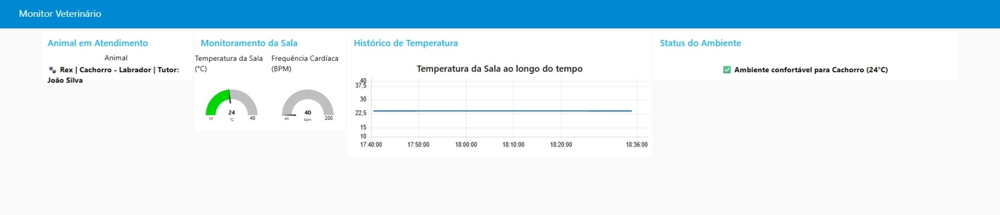
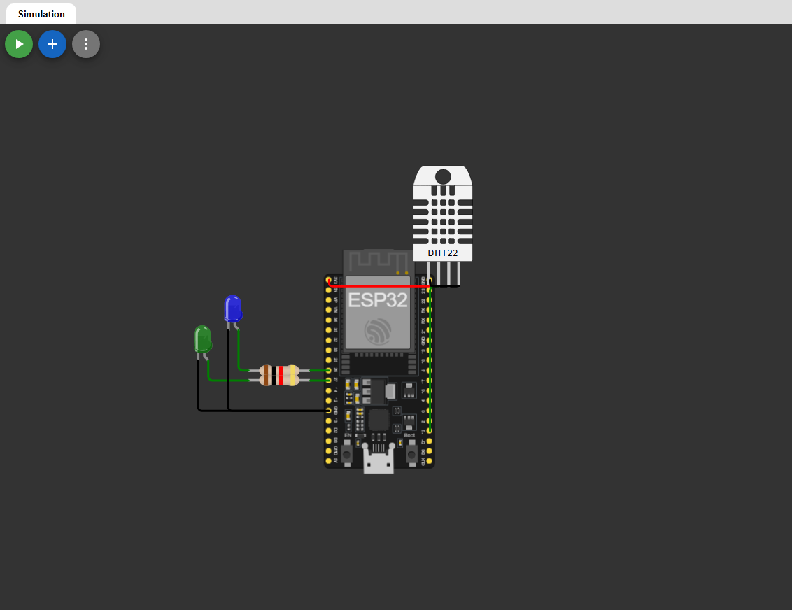

# Sistema de Monitoramento Veterinário IoT

**Monitoramento em tempo real de ambiente em clínica veterinária.**

---

## Sobre o Projeto

O **Sistema de Monitoramento Veterinário IoT** é uma solução que permite o acompanhamento em tempo real da temperatura ambiente da sala de atendimento em uma clínica veterinária.

O sistema detecta automaticamente condições de desconforto térmico e envia alertas instantâneos, ajudando os veterinários a garantirem o bem-estar dos animais.

---

## Funcionalidades

- **Monitoramento em tempo real** da temperatura ambiente
- **Cálculo automático** de conforto térmico por tipo de animal (Cachorro, Gato, Coelho)
- **Alertas visuais e sonoros** quando o ambiente está inadequado
- **Dashboard** com gauges, gráficos históricos e status
- **Cadastro** do animal em atendimento via MQTT
  
---

## Tecnologias Utilizadas

### Hardware
- **ESP32**
- **Sensor DHT22**
- **LEDs**

### Software e Comunicação
- **MQTT** (HiveMQ Broker público)
- **Node-RED** + **Dashboard**
- **Arduino IDE** / **Wokwi**
- **Bibliotecas:**
  - PubSubClient
  - ArduinoJson
  - DHT sensor library

### Simulação
- **Wokwi**

---

## Arquitetura do Sistema

O sistema funciona da seguinte forma:

1. O **ESP32** lê a temperatura do sensor DHT22
2. Verifica se o ambiente está confortável para o tipo de animal
3. Publica os dados via MQTT nos tópicos:
   - `fiap/vet/pet01/dados`
   - `fiap/vet/sala01/alerta`
   - `fiap/vet/cadastro`
4. O **Node-RED** recebe, processa e exibe as informações no dashboard
5. Em caso de desconforto, um **alerta** é exibido no dashboard e no toast

---

## Imagens do Projeto

### Dashboard Node-RED


### Fluxo Node-RED


### Wokwi


---

## Como Executar o Projeto

### 1. Simulação no Wokwi
1. Acesse o link do projeto no Wokwi
2. Clique em **Start Simulation**
3. Abra o Serial Monitor para acompanhar as publicações MQTT

### 2. Node-RED
1. Importe o arquivo `flows.json`
2. Configure o broker MQTT (padrão: `broker.hivemq.com`)
3. Deploy e acesse o dashboard

---

## Estrutura do Repositório

``` 
YourPetHealth-IOT/
├── Imagens/
│   ├── Dashboard.png
│   ├── Fluxo Node-RED.png
│   └── Wokwi.png
├── Wokwi/
│   ├── diagram.json
│   ├── libraries.txt
│   ├── sketch.ino
│   └── wokwi-project.txt
├── flows.json           
└── README.md
```


---

## Resultados Obtidos

- Comunicação MQTT funcionando com sucesso
- Dashboard responsivo e intuitivo
- Sistema de alerta funcional
- Suporte a diferentes tipos de animais com faixas de conforto específicas

---

**Link do Projeto no Wokwi:**  
[https://wokwi.com/projects/464688749816104961](https://wokwi.com/projects/464688749816104961)

